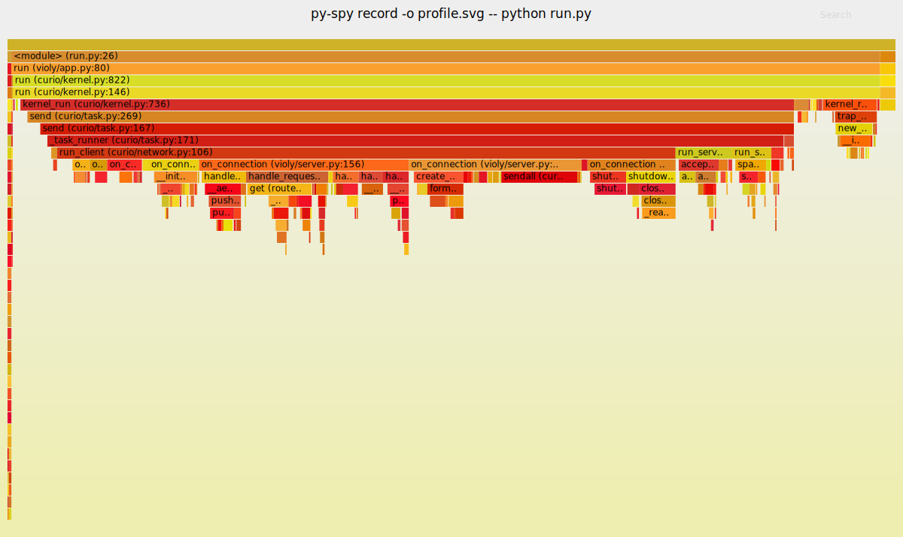

python性能分析工具
###################

:date: 2022-03-08 11:40
:category: python
:tags: profiler
:slug: profiler

py-spy
-------

比较好用的功能是使用 ``record`` 命令生成火焰图

.. code-block:: bash

   $ py-spy record -o profile.svg -- python run.py

或者生成 speedscope_ 格式进行分析

.. _speedscope: https://www.speedscope.app/

.. code-block:: bash

   $ py-spy record --format speedscope -o profile.speedscope.json -- python run.py

